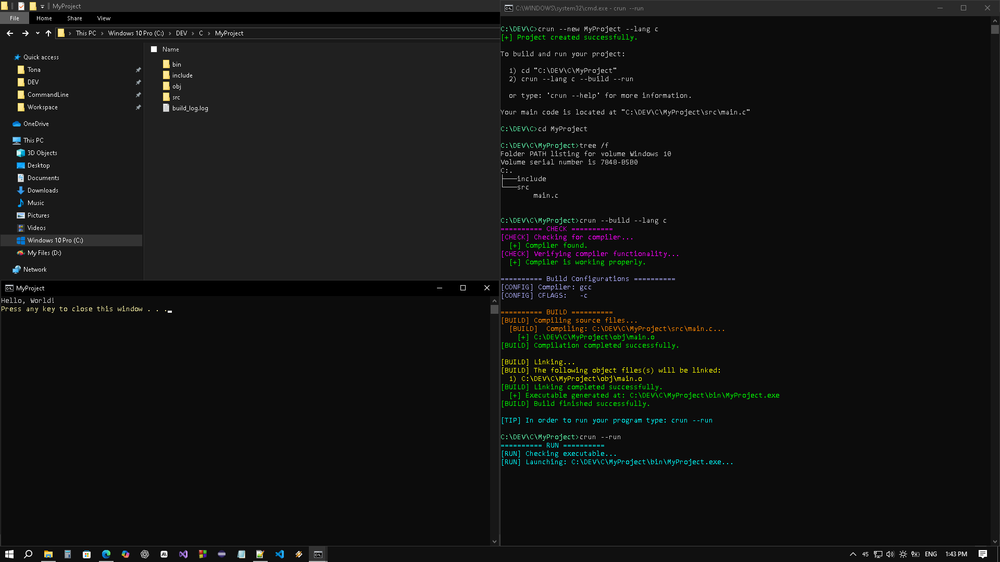
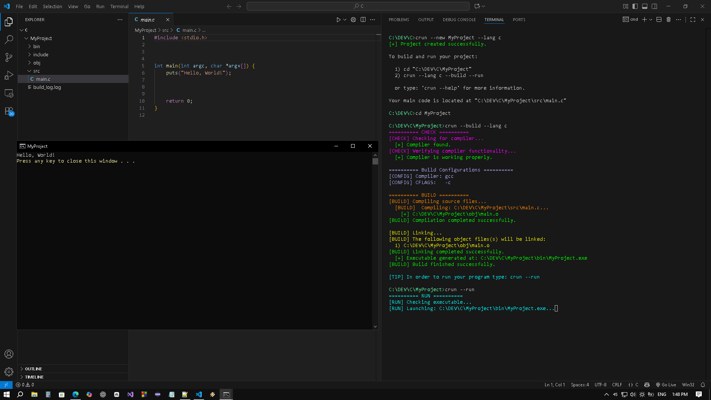
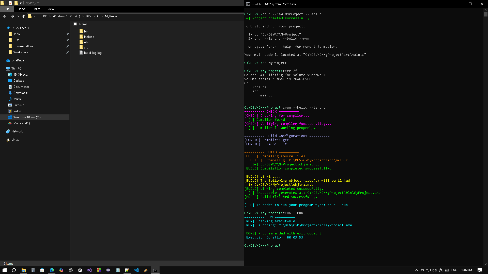
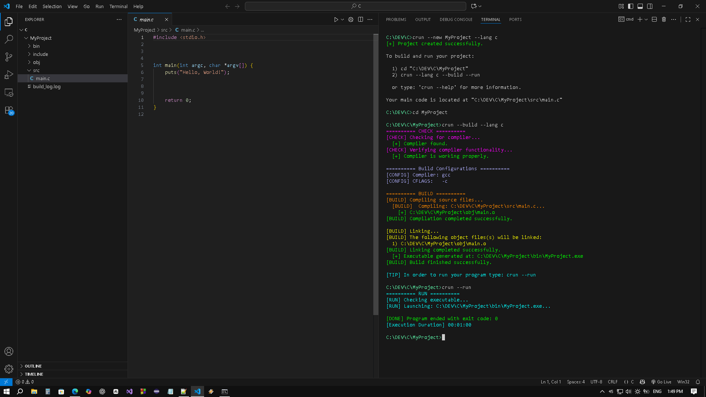
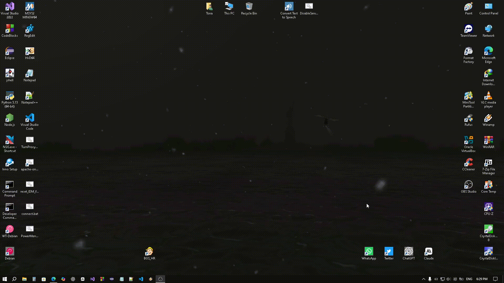

## 📄 Overview
**CRun** is a simple Windows command-line tool for C/C++ projects that automates creating, compiling, linking, and running programs.

<p align="center"></p>

<p align="center">
  
  
  
</p>

---

## 🚀 Features:
- Create simple C and C++ projects.
- Run the compiled program in a separate Command Prompt window.
- Smart build that recompiles only modified source files for faster builds.
- Supports passing compiler and linker options via `--cflags` and `--ldflags`.
- Recursively compiles all source files in the <strong>src</strong> folder with .c, .cpp, .cxx, and .c++ extensions.
- Displays detailed compiling and linking output with awesome colored text.
- Passing arguments to the program when `--run` is set using the `--args` option.
- Captures and reports the exit code of the executed program.

---

## ⬇️  Download and Install CRun
Getting started with **CRun** is easy. Follow the steps below:
1. Download the Latest Release
   - Click the badge below to open the latest release page:
   - <a href="https://github.com/dahyallam/crun-tool/releases/latest" target="_blank"></a>
   - Download **CRun-setup.exe**
   - Run **CRun-setup.exe** and follow the setup wizard to complete the installation.

2. Verify Installation
   - Open **Command Prompt** and run:
   ```
     crun --version
   ```
   - If installed correctly, the current **CRun** version will be displayed.

## 🛠 Command Reference
| Option                        | Description                                                      |
| ----------------------------- |:----------------------------------------------------------------:|
|`--new <name> --lang <c\|cpp>` | Create a new C/C++ project.                                      |
|`--lang <c\|cpp>`              | Select the language used to build the project.                   |
|`--build --lang <c\|cpp>`      | Compile the C/C++ project.                                       |
|`--smart-build`                | Compile and link only modified source files.                     |
|`--cflags "flags..."`          | Additional compiler flags.                                       |
|`--ldflags "flags..."`         | Additional linker flags.                                         |
|`--config <debug\|release>`    | Select build configuration (debug or release).                   |
|`--run`                        | Run the compiled project.                                        |
|`--args <arguments...>`        | Arguments to pass to the program (must be last).                 |
|`--clean`                      | Clean build directories and exit.                                |
|`--clear`                      | Clear the console screen at startup.                             |
|`--install`                    | Install the MinGW-w64 (GCC) compiler.                            |
|`--uninstall`                  | Uninstall the currently installed MinGW-w64 (GCC) compiler.      |
|`--update`                     | Update the CRun tool.                                            |
|`--version`                    | Print the CRun version and exit.                                 |
|`--help`                       | Display this help message and exit.                              |

## 🧩 Examples:
| Example                                     | Description                                |
|---------------------------------------------|:------------------------------------------:|
| `crun --new myapp --lang c`                 | Create a new C project named myapp.        |
| `crun --new myapp --lang cpp`               | Creaet a new C++ project named myapp.      |
| `crun --build --lang c`                     | Build the C project only.                  |
| `crun --build --lang c --run`               | Build and then run the C project.          |
| `crun --build --lang c --config release`    | Build the C project in release mode.       |
| `crun --build --lang c --cflags "-Wall -g"` | Compile using extra compiler flags. <br/> (e.g. -Wall enables all warnings, -g includes debug information). |
| `crun --build --lang c --ldflags "-lm"`     | Compile using extra linker flags (e.g. -lm links the math library). |
| `crun --run`                                | Run the built project only.                |
| `crun --run --args arg1 arg2`               | Run the built program with arguments.      |
| `crun --clean`                              | Remove build files.                        |

---


### ⚙️ Prerequisites
- MinGW-w64 (GCC) compiler is required to build C/C++ projects.
- **CRun** can automatically install MinGW if it is not detected.
- To install open **Command Prompt** and run:
    ```bash
    crun --install
    ```

---

## 💡 Usage

> **Important**: Before doing anything, open the Command Prompt or terminal and navigate to the folder where you want to create your new project in.
>
>> **All CRun commands must be run from the project root** (the folder containing src and include).

### 1. Open Command Prompt and navigate to the folder where you want to create your project in
Example: Navigating to the `DEV` folder on my machine.
```bat
cd /d C:\DEV
```
- This command will navigate to the `DEV` folder that already exists.

### 2. Create a New Project
```bat
crun --new myapp --lang c
```
- Creates a C project named **myapp** in **DEV** folder. with the following structure:
```md
myapp
├── include
├── src
│   └── main.c
```
- For a C++ project, replace `--lang c` with `--lang cpp`
- After creation, you must move into the project folder.
```bat
cd myapp
```

### 3. Build the Project
```bat
crun --build --lang c
```
- Compiles all C source files in the `src` folder and links them into an executable in the `bin` folder.
- For a C++ project, replace `--lang c` with `--lang cpp`

```bat
crun --build --lang c --config release
```
- Builds the project in release mode with optimizations.

```bat
crun --build --smart-build --cflags "-Wall -g" --ldflags "-lm"
```
- `--smart-build`: only compiles files that have changed since the last build.
- `--cflags`: extra compiler flags (here `-Wall -g` for all warnings and debugging info).
- `--ldflags`: extra linker flags (here `-lm` linking the math library).

### 4. Run the Project
```bat
crun --run
```
- Runs the compiled program in a new console window.
- After running, CRun shows the exit code and execution duration.

```bat
crun --run --args One Two "Hello, World"
```
- Passes arguments to your program where argv[1] = One, argv[2] = Two and argv[3] = Hello, World

### 5. Build and Run at the same time
```bat
crun --build --lang c --run
```
- Builds the project and immediately runs the executable.

### 6. Clean Build Files
```bat
crun --clean
```
- Deletes all compiled object files and the executable. Useful before a full rebuild.

### 7. Install / Uninstall MinGW-w64 (GCC)
```bat
crun --install
```
- Downloads and installs MinGW-w64 (GCC) compiler if not already installed.

```bat
crun --uninstall
```
- Removes the installed MinGW-w64 (GCC) compiler.

### 8. Update CRun
```bat
crun --update
```
- Updates the tool to the latest version.

### 9. Additional Options
- `--clear` — Clears the terminal before building/running the program.
- `--version` — Displays the current version of CRun.
- `--help` — Shows full usage instructions and available commands.

## 📸 Screenshots
| Command Prompt               | Visual Studio Code           |
|:----------------------------:|:----------------------------:|
|  |  |
|  |  |
|  |  |
